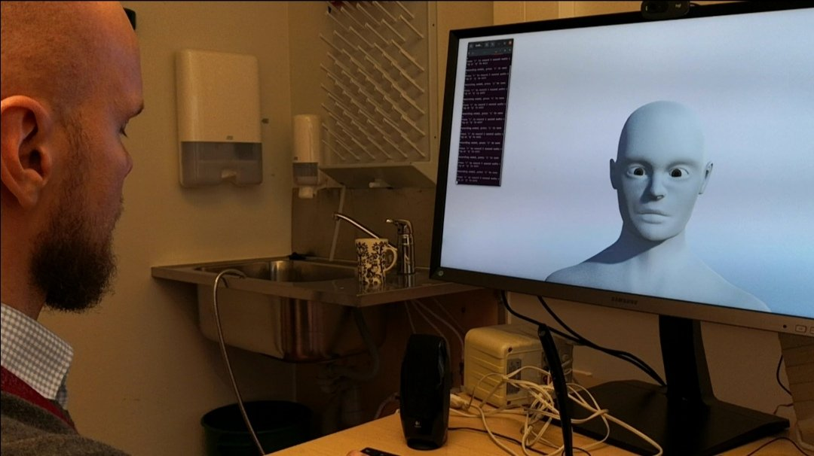
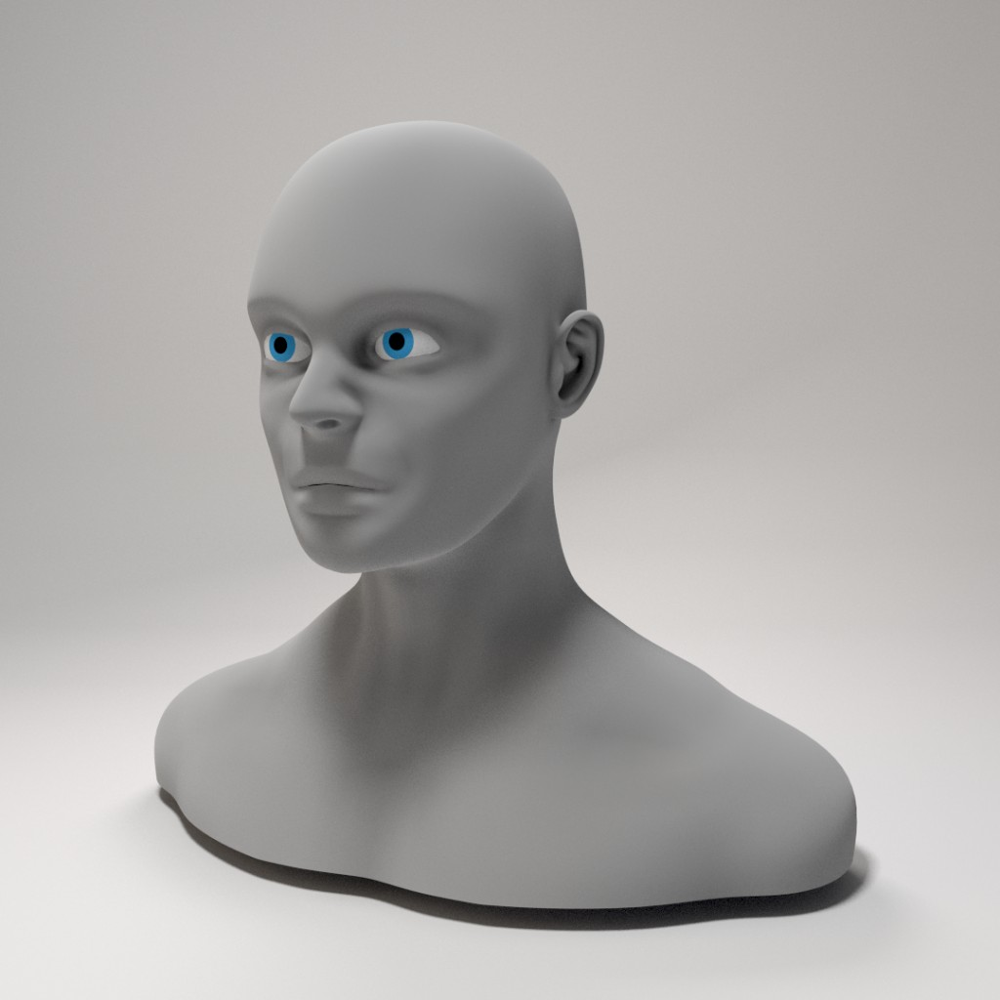
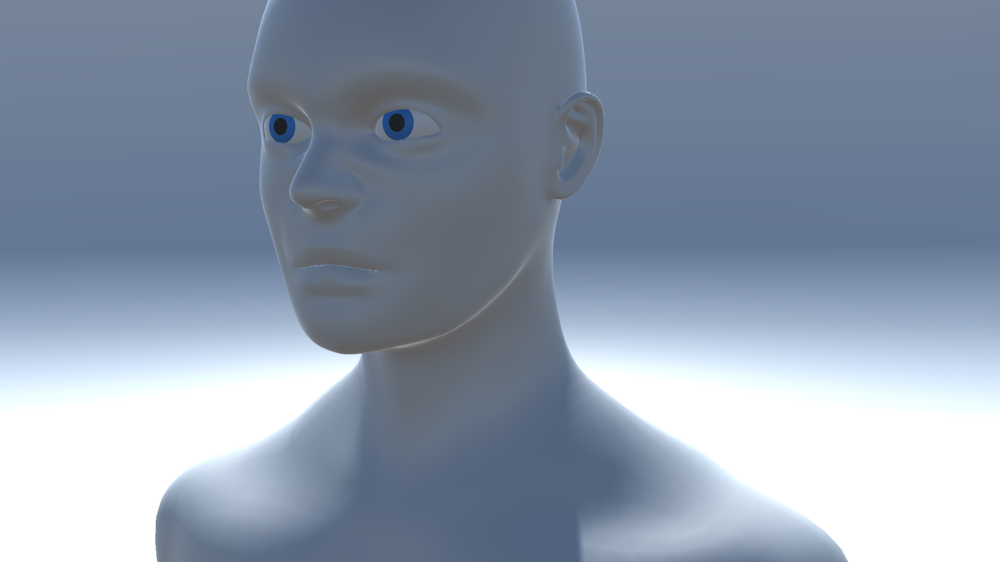

# Avatar - A Virtual AI Bot
Avatar is a conversational AI bot that can be used to study human AI interaction. The bot wake-up word is "Avatar" after which it expects a question which it then responds. Avatar remembers the previous dialog (state).

<p align="center">
    
</p>

Avatar has a modular structure since parts of it have been made as Signal Processing and Machine Learning BSc theses in Tampere University, Finland:

 * [Talking head](#talking-head) - Unity animated virtual head by Konsta Jurvanen (2023) - [Thesis](https://urn.fi/URN:NBN:fi:tuni-202211068199) / [Code](https://github.com/konstajurvanen/AvatarFace)

## Talking head
Konsta's original code is available at [konstajurvanen/AvatarFace](https://github.com/konstajurvanen/AvatarFace). The code, however, does not contain much documentation is thus difficult to use. However, his thesis gives a lot of details that help to replicate the Avatar's talking head. Since this part is implementation-wise interesting and visual interaction plays a crucial role, some details for basic understanding of face animation is given. The following four increasingly more complicated models can be implemented:

 * Level 0 - static head that does not move
 * Level 1 - static head that nods when its name "Avatar" is detected
 * Level 2 - eyes follow the closest person (requires a Webcam)
 * Level 3 - mouth moves when the Avatar speaks

### A virtual head model (Blender)
A suitable model can be drawn and animated using the [Blender](https://en.wikipedia.org/wiki/Blender_(software)) tool. Blender is a free and open-source 3D computer graphics software tool set used for creating animated films, visual effects, art, 3D-printed models, motion graphics, interactive 3D applications, virtual reality, and, formerly, video games. 

#### Level 0 model
Since the level 0 model is completely static any 2D or 3D head model can be used. However, a suitable 3D model is easier to extend to the
higher level models and is thus preferred. The following public domain (CC0) lisenced "Male Head" blender model from the blendswap.com
is suitable for this purpose.

<p align="center">
    
</p>

The model can be downloaded from

 * [https://blendswap.com/blend/11745](https://blendswap.com/blend/11745) (you need to register to be able to download the model). 

and stored (the model zip is available in this Github repo). 

#### Level 1 model
TBD

#### Level 2 model
TBD

 * [Eye Rigging Tutorial in Blender](https://www.youtube.com/watch?v=pzfKz8NX1rQ)

#### Level 3 model
TBD

 * [Blender - Mouth Rigging Tutorial](https://www.youtube.com/watch?v=Map_ro-xUwg)

### Adding animation components to the head model (Unity)
[Unity](https://en.wikipedia.org/wiki/Unity_(game_engine)) is a cross-platform game engine developed by Unity Technologies and has been extended to support a variety of desktop, mobile, console and virtual reality platforms. The engine can be used to create three-dimensional (3D) and two-dimensional (2D) games, as well as interactive simulations and other experiences.  

To install and learn how to do simple animations the following instructions are recommended:

 * [Install the Unity Hub](https://docs.unity3d.com/hub/manual/InstallHub.html)
 * [Beginner's guide](https://forum.unity.com/threads/linux-beginners-guide-for-developers.978321/)
 * [Unity 2D Pong Game](https://noobtuts.com/unity/2d-pong-game)

### Creating a standalone application
For each level (0-3) animated face there is a Unity Hub project included to this repository. A new project can be generated by selecting "New Project"
item from the Unity Hub (Core 3D) and then adding one of the above Blender based face models. The following models can be added as new assets:

 * Level 0 is the original "Male head" included to the downloads/male-head.zip (MaleBustBS.blend) - Unity load: avatar/animated_face/level_0/

After loading the model, the executable must be built for the target platform and OS. To make the scripts work properly make the build to the following location:

 * avatar/bin/avatar_face

The model can be tested as following:
```
$ cd <WORKDIR>/avatar/bin
$ ./avatar_face.x86_64
```
that should open a window that shows the Avatar face.

<p align="center">
    
</p>


